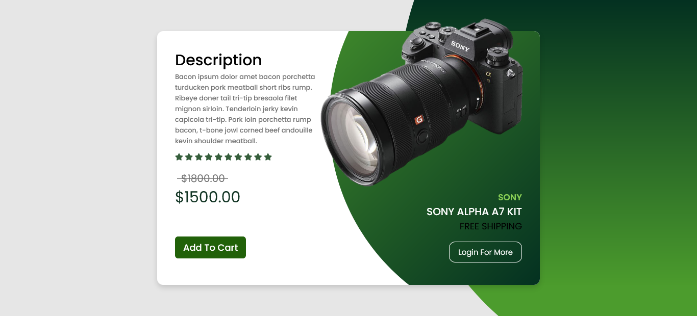

<h1>E-commerce Product Card :camera:</h1>

<h2>A product card created using only HTML and CSS.</h2>

This website is created using a bit of flexbox, position property, and CSS custom properties. I created this following the tutorial of CodingLab. I've changed the color scheme, and updated the values of measures from px to rem. I really enjoyed the how you create the circles in the project to add effect to the product. This project was fun to build and beginner friendly.

### Link

- Live Site: [E-commerce Product Card](https://leslielopez25.github.io/3D-Flip-Card/)

### Screenshot

